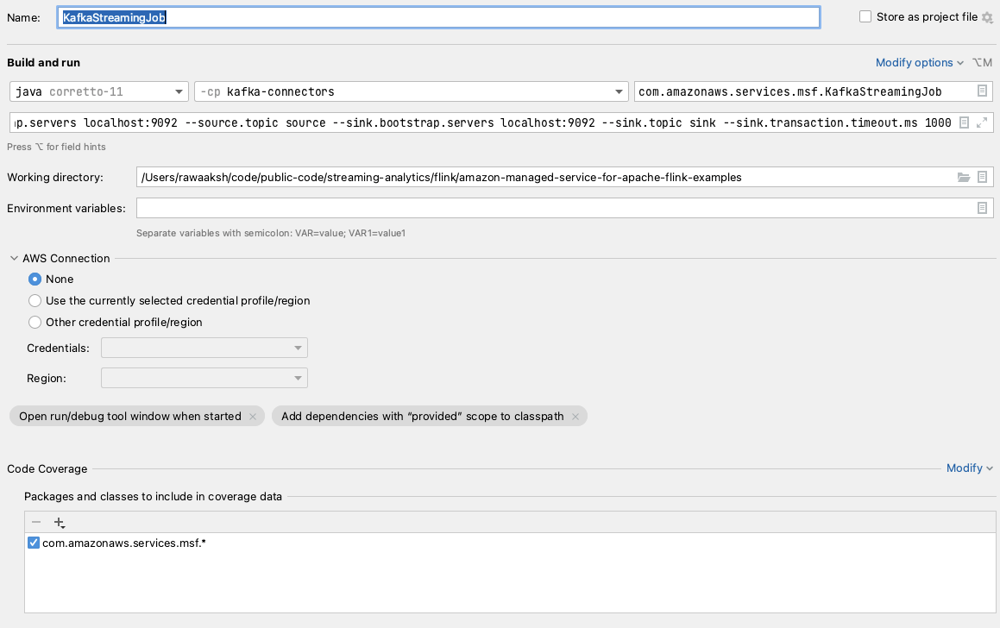
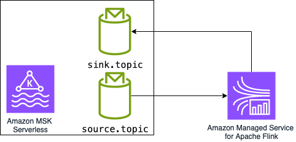

# Flink Kafka Source & Sink Examples

* Flink version: 1.15
* Flink API: DataStream API
* Language: Java (11)


This example demonstrate how to use
[Flink Kafka Connector](https://nightlies.apache.org/flink/flink-docs-release-1.15/docs/connectors/datastream/kafka/),
source and sink.

This example uses on `KafkaSource` and `KafkaSink`.

,

Note that the old 
[`FlinkKafkaConsumer`](https://nightlies.apache.org/flink/flink-docs-release-1.13/docs/connectors/datastream/kafka/#kafka-sourcefunction) 
and [`FlinkKafkaProducers`](https://nightlies.apache.org/flink/flink-docs-release-1.13/docs/connectors/datastream/kafka/#kafka-producer)
are deprecated since Flink 1.15

## Runtime configuration

The application reads the runtime configuration from the Runtime Properties, when running on Amazon Managed Service for Apache Flink,
or from command line parameters, when running locally.

Runtime Properties are expected in the Group ID `FlinkApplicationProperties`.
Command line parameters should be prepended by `--`.

They are all case-sensitive.

Configuration parameters:

* `source.bootstrap.servers` source cluster boostrap servers
* `source.topic` source topic (default: `source`)
* `sink.bootstrap.servers` sink cluster bootstrap servers
* `sink.topic` sink topic (default: `destination`)
* `sink.transaction.timeout.ms` Sink transaction timeout 

If you are connecting with no-auth and no SSL, above will work. Else you need additional configuration for both source and sink.
### For IAM Auth


* `source.sasl.mechanism` AWS_MSK_IAM
* `source.sasl.client.callback.handler.class` software.amazon.msk.auth.iam.IAMClientCallbackHandler
* `source.sasl.jaas.config` "software.amazon.msk.auth.iam.IAMLoginModule required;"
* `source.security.protocol` SASL_SSL
* `source.ssl.truststore.location` /usr/lib/jvm/java-11-amazon-corretto/lib/security/cacerts
* `source.ssl.truststore.password` changeit
* `sink.sasl.mechanism` AWS_MSK_IAM
* `sink.sasl.client.callback.handler.class` software.amazon.msk.auth.iam.IAMClientCallbackHandler
* `sink.sasl.jaas.config` "software.amazon.msk.auth.iam.IAMLoginModule required;"
* `sink.security.protocol` SASL_SSL
* `sink.ssl.truststore.location` /usr/lib/jvm/java-11-amazon-corretto/lib/security/cacerts
* `sink.ssl.truststore.password` changeit


## Running locally in IntelliJ

To run this example locally - 
* Run a Kafka cluster locally. You can refer https://kafka.apache.org/quickstart to download and start Kafka locally.
* Create `source` and `sink` topics. 
* To start the Flink job in IntelliJ edit the Run/Debug configuration enabling *'Add dependencies with "provided" scope to the classpath'*.

Provide arguments like following -
```
--source.bootstrap.servers localhost:9092 --source.topic source --sink.bootstrap.servers localhost:9092 --sink.topic sink --sink.transaction.timeout.ms 1000
```

Following is the screenshot of run configuration


## Running locally through Maven command line
To run this example locally -
* Run a Kafka cluster locally. You can refer https://kafka.apache.org/quickstart to download and start Kafka locally.
* Create `source` and `sink` topics.
* Execute following command from the project home directory -
```
 mvn clean compile exec:java -Dexec.classpathScope="compile" \
 -Dexec.mainClass="com.amazonaws.services.msf.KafkaStreamingJob" \
 -Dexec.args="--source.bootstrap.servers localhost:9092 --source.topic source --sink.bootstrap.servers localhost:9092 --sink.topic sink --sink.transaction.timeout.ms 1000" 

```

## Deploying using CloudFormation to Amazon Managed Service for Apache Flink
This sample assumes that MSK Serverless cluster is created. The flink application routes data ingested in source topic to sink topic without any transformation. 

,
### Pre-requisite
1. Create MSK serverless cluster while choosing 3 subnets. Refer https://docs.aws.amazon.com/msk/latest/developerguide/serverless-getting-started.html . 
2. Once the cluster is created note down subnets ids of the cluster and security group.
3. Ensure that security group has self referencing ingress rule that allows connection on port 9098. 
4. You have a user credential using which you can create CloudFormation stack from console or CLI. 


### Build and deployment

1. The steps below create stack with [CloudFormation Template](./cloudformation/msf-msk-iam-auth.yaml).
2. The script `deploy.sh` creates the stack using AWS CLI. Ensure that AWS CLI is configured and your user has permissions to create CloudFormation stack.
3. Alternatively you can deploy using  [CloudFormation Template](./cloudformation/msf-msk-iam-auth.yaml) from Console and pass required parameters.
4. Edit `deploy.sh` to modify  "Region and Network configuration" . Modify following configurations -  
* region= Deployment region
* SecurityGroup= MSK Security Group. 
* SubnetOne= MSK Subnet one
* SubnetTwo= MSK Subnet two
* SubnetThree= MSK Subnet three

5. Edit `deploy.sh` to modify "MSK configuration". Modify following configurations -
* kafka_bootstrap_server= MSK Serverless bootstrap server. 
* source_topic= Source topic. 
* sink_topic= Sink topic. 
Ensure that source and sink topics are created. 

6. Build Code. Execute the script below which will build the jar and upload the jar to S3 at s3://<bucket-name>/flink/kafka-connectors-1.0.jar.
```shell
./build.sh <bucket-name-to-upload>
```

7. Run `deploy.sh` to deploy the CloudFormation template . Refer the sample CloudFormation template at `cloudformation/msf-msk-iam-auth.yaml` . 
The CloudFormation needs the jar to be there at s3://<bucket-name>/flink/kafka-connectors-1.0.jar. 

```
./deploy.sh <bucket-name-to-upload> 
```
8. The template creates following resources -
* Flink application with application name defined by application_name in deploy.sh. 
* CloudWatch log group with name - /aws/amazon-msf/${application_name}
* CloudWatch log stream under the log group created above by name amazon-msf-log-stream. 
* IAM execution role for Flink application. The role permission on MSK cluster.
* IAM managed policy. 
